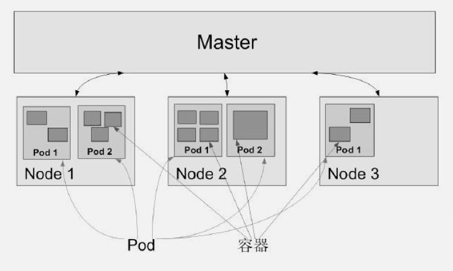
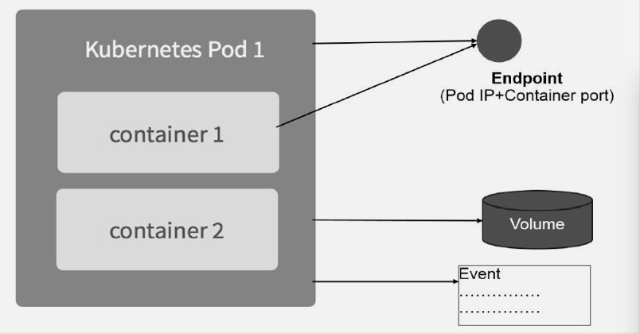

# kubernetes 基本概念

## Master
1. 集群的大脑
2. 提供Kubernetes API 提供 HTTP REST
3. controller manager 自动化控制中心
4. scheduler 负责 Pod 调度
5. 依赖 etcd Server 进程, 因为Kubernetes 所有资源对象的数据都是保存在 etcd 中。




## Node (也叫做Minion)

工作负载, 每个Node都运行着以下一组关键进程
1. kubelet: 负责Pod对应的容器创建、启停等任务, 与Master节点密切协作实现集群基本管理功能。
2. kube-proxy: 实现 kubernetes Services 的通信与负载均衡机制的重要组件
3. Docker Engine(docker)

Node 节点可以动态添加到 Kubernetes 集群中
默认情况 kubelete 会向 Master 注册自己。

```bash
# 查看 nodes
kubectl get nodes
# 查看 node 详情
kubectl describe node <nodeName>

...
```

## Pod

Pod 是 Kubernetes **最重要** 也 **最基本** 的概念.
每个 Pod 都有一个特殊的被称为 Pause 容器. 

> Pause 容器对应的镜像属于 Kuberentes 平台的一部分, 
除了 Pause 容器,每个Pod 还包含一个或者多个紧密相关的业务容器

> 为什么会有 Pod 这样的概念和这样的的结构 ?

1. 在一组容器作为一个单元时， 我们难以对“整体” 简单的进行判断是否 "存活", N/M 存活率?
2. Pod 中多个业务容器共享 Pause 容器的 IP, 共享 Pause 容器挂载的 Volume, 这样简化了密切关联的业务容器之间的通信问题 和 文件管理问题。

特点:

1. Pod IP: kubernetes 为每个 Pod 都分配了一个唯一的 IP 地址, 成为 Pod IP, Pod 里的多个容器共享该 Pod IP 地址
2. Pod 通信: 任意两个 Pod 之间 TCP/IP 直接通信, 这通常采用 虚拟二层网络技术来实现, 例如 Flannel、Openvswitch 等。
3. 普通 Pod 和 静态 Pod: 
  - 静态Pod : 它并不存放在 Kubernetes 的 etcd 存储里, 而是放在某个具体的 Node 上的具体文件中。并且只有此Node 启动。
  - 普通Pod : 一旦创建就会被放入 etcd 中存储, 随后会被 Kuberentes Master 参与调度
4. Pod Volume: Docker Volume 在 Kubernetes 中也有对应的概念 Pod Volume
  - 扩展分布式文件系统 GlusterFS 实现后端存储功能。
5. Event 概念: 事件的记录
  - 记录最早产生事件，最后重现事件，重复次数，发起者，类型以及导致此事件的原因等信息
  - Event 通常会官僚到某个具体的资源对象上
6. 限制： Pod 可以对其能使用的服务器上的计算资源设置限额
  - 当前可以设置的计算资源有 CPU 和 Memory 两种, 其中 CPU 的资源单位为 CPU 的数量，是 __一个绝对值而非相对值__, Momeory 配额也是一个绝对值, 它的单位是内存字节数
  - 在Kubernetes 里，一个计算资源进行配额限定需要设定以下两个参数
    - Requests: 该资源的最小申请量, 系统必须满足
    - Limits: 该资源最大允许使用量, 不能被突破, 当容器试图超过这个量时，可能会被 Kubernetes Kill 并重启
7. EndPoint: 代表此 Pod 的一个服务进程对外通信地址，一个Pod 也存在有多个Endpoint 的情况。



```yaml
apiVersion: v1 
kind: Pod 
metadata: 
  # pod 名字
  name: myweb
  # 拥有 name=myweb 标签
  labels: 
    name: myweb 
spec: 
  containers: 
    - name: myweb 
      image: kubeguide/tomcat-app:v1
      ports: 
        - containerPort: 8080 
      env: 
        - name: MYSQL_SERVICE_HOST 
          value: 'mysql' 
        - name: MYSQL_SERVICE_PORT 
          value: '3306'
      resources: 
        requests: 
          # 至少需要 64MiB
          memory: "64Mi"
          # 0.25 个CPU
          cpu: "250m"
        limits: 
          # 最多 128MiB
          memory: "128Mi"
          # 0.5 CPU
          cpu: "500m"

```


## Label (标签)

Kubernetes 系统中另一个核心概念。一个Label 是一个 key=value 键值对， 其中 key 与 value 由用户自己制定。

多对多关系: Label 可以 __附加到各种资源对象上__,
例如 Node, Pod, Service, RC 等,
一个资源对象可以有任意数量的Label,
同一个Label 也可以附加到任意数量的Label

定义: 通常在创建资源时定义,创建后可以动态添加货真删除

> 功能：
>> 可以绑定多个Label 来实现多维度的资源分组管理。
>> 可以通过 Selector 查询和筛选拥有某些 Label 的资源对象

例如:
```md
版本标签 "release":"stable"/"canary"
环境标签 "enviroment": "dev"/"qa"/"production"
架构标签: "tier":"frontend"/"backend"/"middleware"
分区标签: "partition":"custmerA"/"customerB"
质量管控标签: "track":"daily"/"weekly"
```

> label Selector

当前有两种表达式, 基于等式(Equality-based) 和 基于集合(Set-based)

1. 基于等式
  - name=redis-slave: 匹配所有符合的资源对象
  - name!= prod: 匹配所有非 name=prod 的
2. 基于集合
  - name in (redis-mater, redis-slave): 匹配所有 redis-mater 或者 redis-slave
  - name notin (php-fronted) 匹配所有不具有 php-fronted

> 使用场景

> Kuber-controller 通过资源对象 RC 定义的 label Selector 筛选要监控的副本数量
> Kuber-proxy 通过 Service 的 Label Selector 来选择对应的 Pod, 从而实现 Service 对 Pod 的请求转发路由表, 从而实现 Service 的智能负载均衡。
> 通过Node定义的Label, 实现定向调度


## Replication Controller(RC)

核心概念, 定义一个期望场景, 即声明某种 Pod 副本数量在任意时刻
都符合某个预期值, 所以 RC 定义了以下几个部分。

- Pod 期待数量的副本数(replicas)
- 用于筛选目标 Pod 的 Label Selector
- 当 Pod 的副本数量小于 预期值时, 用于创建新 Pod 的模板(template)

以下是一个完整的 rc 定义
```yaml
apiVersion: v1 
kind: ReplicationController 
metadata: 
  name: frontend
spec: 
  replicas: 1 
  selector: 
    # 与 template 相同 否则会无限创建
    tier: frontend 
  template: 
    metadata: 
      labels: 
        app: app-demo 
        tier: frontend 
        spec: 
          containers: 
            - name: tomcat-demo 
              image: tomcat 
              imagePullPolicy: IfNotPresent 
              env: 
                - name: GET_HOSTS_FROM 
                  value: dns 
              ports: 
                - containerPort: 80
```
将上面的RC 提交到 Kubernetes 集群的 Mater 节点上的 Controller Manager 组件就得到通知, 定期检查系统中存活的目标 Pod, 并确保 Pod 实力数量相同如果小于期望值 则创建, 过多则暂停。

更新 RC
删除 RC 并不会影响通过该 RC 已创建好的 Pod, 可以先设置 replicas 再更新RC。另外,
kubectrl 提供 stop 和 delete 命令来一次性删除 RC 和 RC 控制的全部 Pod


> Rolling Update

滚动升级, 详见第4章

> Replica Set - 下一代的 RC

总结 RC 特性与作用
- 通常使用 RC 实现 Pod 的创建以及副本数量的控制
- RC 里包括完整的 Pod 定义模板
- RC 通过 Label Selector 机制对实现 Pod 副本的自动控制
- 通过RC 的 Pod 副本数量, 可以扩展或者缩容 Pod
- 通过RC 里的Pod 模板中的镜像版本, 可以海鲜 Pod 的滚动升级